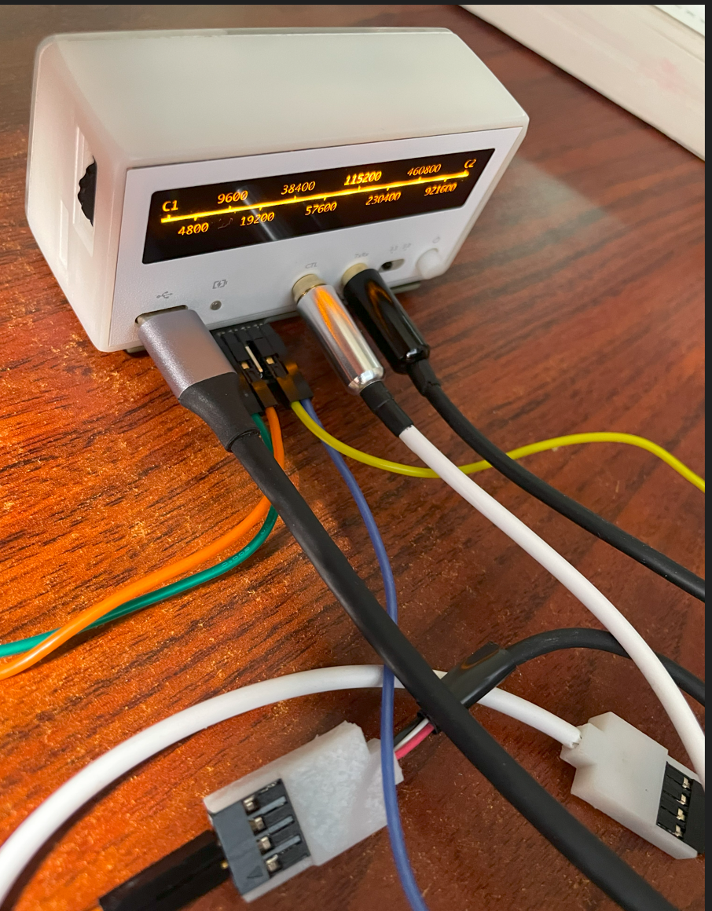
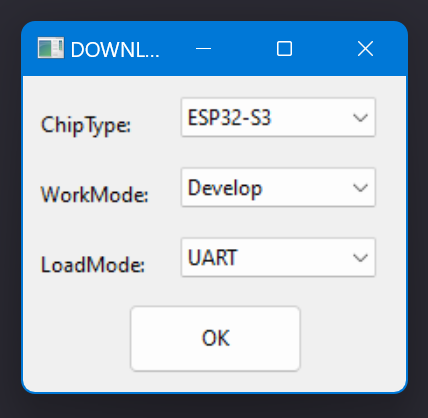
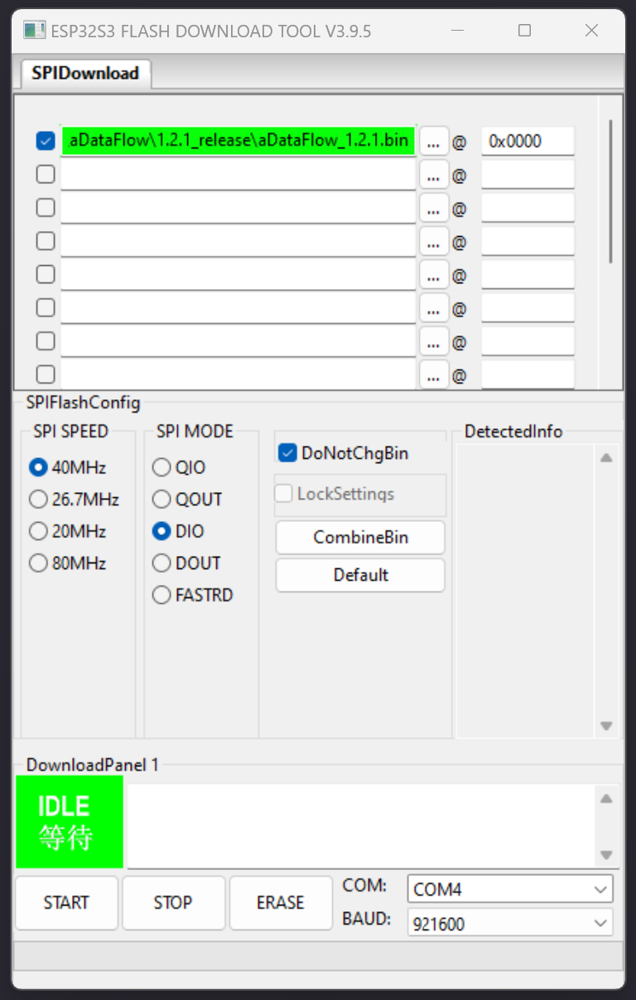
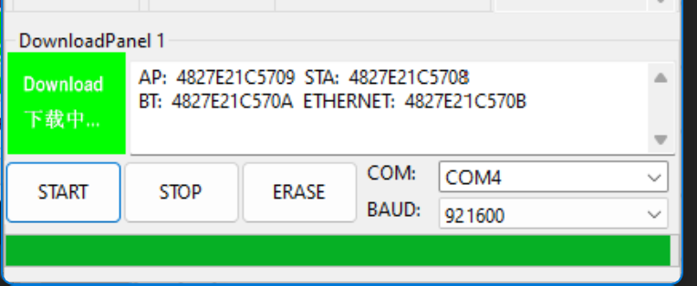
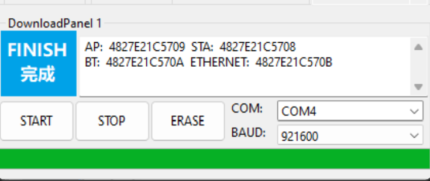
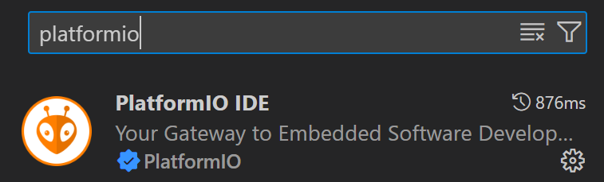
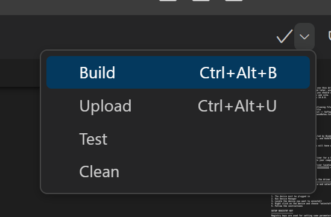
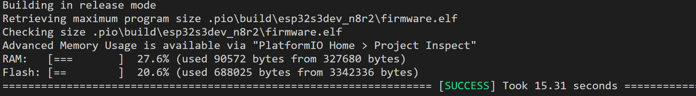
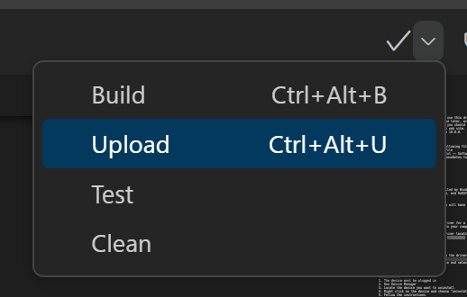
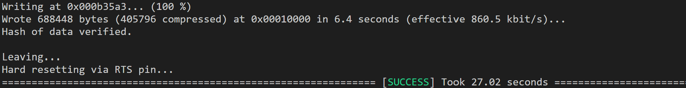

## 带灯效的串口查看器 - 给小白的刷机教程

> 我作为一个对嵌入式开发一无所知的小白，怎么给刚做好的串口查看器刷机呢？这篇文章会给你答案。带灯效的串口查看器名字太长。在下文中我们以小白白来称呼它（同事看到这小东西给取的外号）

注：如果对文章任何地方有问题欢迎在群里指正。

日期: 2024-2-4

作者：amagsty，Justin

### :earth_asia:  小白白项目Gitee仓库链接

    aDataFLow: [aDataFlow: 带灯效的串口查看器](https://gitee.com/amagsty/adataflow)

### :wrench: 小白白组装指南

    完整版: [Assembly-Guide.pdf](https://gitee.com/amagsty/adataflow/blob/main/doc/manual/Assembly-Guide.pdf)

    简易版：[组装参考及使用说明.pdf](https://gitee.com/amagsty/adataflow/blob/main/doc/manual/%E7%BB%84%E8%A3%85%E5%8F%82%E8%80%83%E5%8F%8A%E4%BD%BF%E7%94%A8%E8%AF%B4%E6%98%8E.pdf)

### :green_book: 准备工作

1. 按照组装指南完整版制作两根黑白两根引线。

2. 使用USB TypeC线连接小白白和电脑。(确保你的线是可以走数据的不是只充电)
   
   

3. 此时电脑会无法正确识别到你的小白白，显示已连接但没有驱动.

4. 你需要安装驱动。驱动下载地址是 [CP210x Universal Windows Driver](https://www.silabs.com/documents/public/software/CP210x_Universal_Windows_Driver.zip)

5. 解压后得到“CP210x_Universal_Windows_Driver”文件夹

6. 打开你的设备管理器找到下面设备。CP210x USB to UART Bridge

7. 双击后找到更新驱动选择从电脑中找驱动，选择前面你解压后的文件夹。

8. 正确安装驱动后你会在Ports下看到你的设备叫做
   
   1. “Silicon Labs CP210x USB to UART Bridge (COM4)”

9. 你也可能不是COM4没关系记住这个一会儿要用。

#### 恭喜你顺利完成驱动安装 :white_check_mark:。

在开始刷机前需要您选择是想简单刷机还是希望进行开发工作：

| 目的    | 路线       |
| ----- | -------- |
| 想简单刷机 | 刷机工具路线   |
| 想学习开发 | vscode路线 |

---

### :grinning: 刷机工具路线

第一步：

    下载刷机工具并解压：

            直接下载： [Flash 下载工具](https://www.espressif.com/sites/default/files/tools/flash_download_tool_3.9.5_0.zip)

            工具详情：[工具 | 乐鑫科技](https://www.espressif.com/zh-hans/support/download/other-tools)

第二步：

    去仓库下载已经准备好的bin文件：下载点 [这里](https://gitee.com/amagsty/adataflow/releases/download/v1.2.1/aDataFlow_1.2.1.bin)

打开刷机工具 `flash_download_tool_3.9.5`

设置如下

点击OK

按如下内容修改你的设置。选择前面下载的bin文件。右下角正确设置你的COM我是COM4

点击 `START` 开始刷:baby_chick:吧. 刷机过程中小白白会黑屏属于正常。刷机结束后重启小白白。

#### 恭喜你闯过了刷机工具路线。:white_check_mark:

如果你想用小白白开发点自己的项目可以继续尝试下面的vscode路线

### :man_technologist: vscode路线

首先安装vscode: [Download Visual Studio Code - Mac, Linux, Windows](https://code.visualstudio.com/Download))

打开vscode：

1. 安装PlatformIO. 在插件中

        

    2. 搜索PlatformIO并安装

        

3. 安装需要点时间，成功后会被提醒重启vscode。

4. 接下来去项目库git clone源代码或者点击[这里下载](https://gitee.com/amagsty/adataflow/archive/refs/tags/v1.2.1.zip)。推荐git clone方便后续更新。如果这步操作有困难建议跳过这个路线。

5. 使用vscode打开clone下来的文件夹。此时需要拷贝Boards文件夹否侧PlatformIO无法正确识别board类型。
   
   1. 拷贝 `aDataFlow/others/Boards` 文件夹到`%HOMEPATH%/.platformio`文件夹下面. 如果看不见`.platformio`文件夹请打开显示隐藏文件. HOMEPATH就是你的用户文件夹也是桌面的上一级。

6. 此时回到vscode点击右上角的Build按键

        

        可能你会遇到error提示缺少lv_conf.h文件。

> 我的解决办法是拷贝 `aDataFlow/others/lv_conf.h`到`adataflow\.pio\libdeps\esp32s3dev_n8r2\lvgl` 文件夹中

7. 重新Build

        

8. 成功build后连接上你的小白白点击Upload按键

        

        上传过程中小白白会黑屏并重启属于正常

        

#### 成功上传后，恭喜你成功为小白白搭建了开发环境 :white_check_mark:。

---

### 其他参考文档：

1. 如果你的小白白连接电脑刷机显示乱码记得用小白白右边的滑轮调整波特值为115200

2. CP210x USB to UART bridge VCP Drivers: [CP210x USB to UART Bridge VCP Drivers - Silicon Labs](https://www.silabs.com/developers/usb-to-uart-bridge-vcp-drivers?tab=downloads)

3. [ESP32官方文档](https://www.espressif.com/sites/default/files/documentation/esp32-s3-wroom-1_wroom-1u_datasheet_en.pdf)
